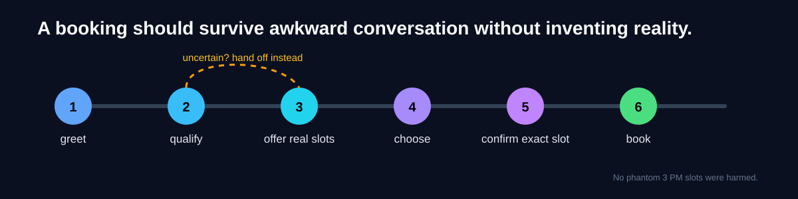

# AI Booking Workflow

**Calendars are simple until somebody says “Friday-ish, after lunch, but not too late.”**

This is the public booking-truth slice from my DentSignal work. The point is not to build another calendar SDK. The point is to make sure an AI assistant cannot smoothly talk its way into booking something that never existed.

## The contract

- only offer slots the system actually received;
- low confidence goes to a human;
- confirmation must match the slot the caller selected;
- the selected slot must still be one of the offered slots;
- empty availability is not permission to improvise.

The code is split by responsibility instead of hiding everything in one “smart” file: availability cleanup, guardrails, state models, and the conversation FSM are separate.

## Why I care about this

Voice agents can sound extremely confident while being operationally wrong. A pleasant sentence does not make a made-up appointment less annoying.

So this repo makes the boring thing explicit: **the action must be traceable to verified state.**

## What is inside

| Area | Purpose |
|---|---|
| `src/booking_workflow/models.py` | small state/value types |
| `availability.py` | normalize provider slots without inventing any |
| `guardrails.py` | handoff and exact-confirmation rules |
| `fsm.py` | deterministic booking conversation |
| `tests/` | transition, availability, and guardrail behavior |
| `docs/` | design choices and workflow |

## The escape hatch is part of the product

A human handoff is not a failed AI demo. It is the correct result when the system cannot prove the next action.

There is no patient data, calendar credential, provider SDK, or production telephony in this public slice. Those belong in the private system, where they can be handled with the controls they require.

Want to audit the booking truth? Read the [invariants](docs/invariants.md), [failure modes](docs/failure-modes.md), [state table](docs/state-table.md), and [walkthrough](docs/walkthrough.md).

> The AI is allowed to be charming. The booking is not allowed to be fictional.

## Inspect deeper

- [Design overview](docs/overview.md)
- [Why the design looks this way](docs/decisions.md)
- [How it fails on purpose](docs/failure-modes.md)
- [Security / privacy boundary](SECURITY.md)

The README is the front door. The interesting arguments are in those files.
