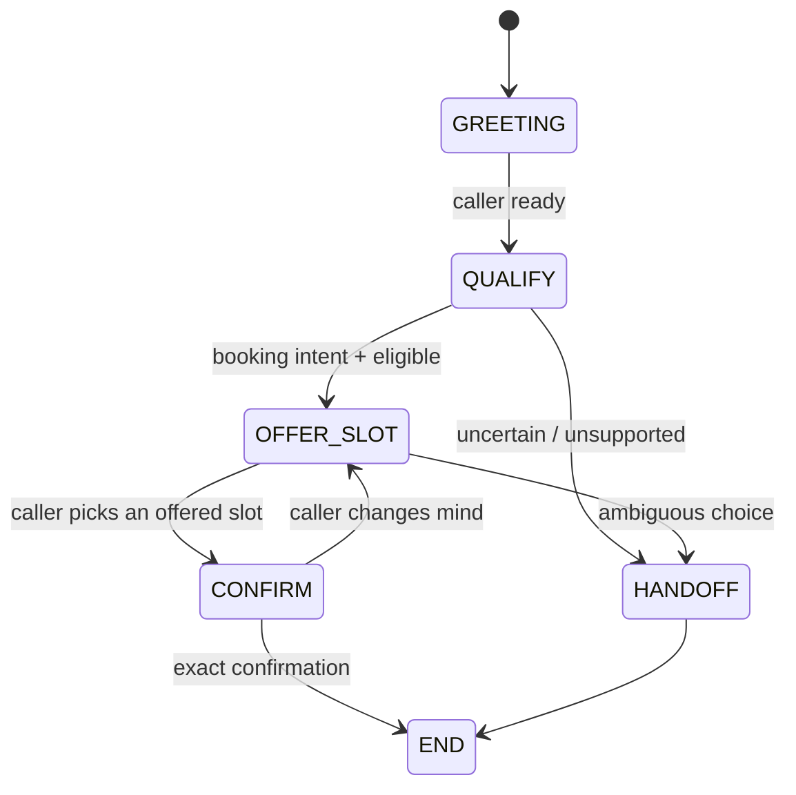

# AI Booking Workflow

**Calendars are simple right up until a human says “sometime Friday afternoon.”**

This repo is a small public slice of the booking logic behind DentSignal. It shows a deterministic booking state machine where the assistant can talk, offer, confirm, or hand off — but cannot magically invent availability.

## Flow



The rule that matters: **no booking side effect exists until the caller confirms a slot that was actually offered.**

## What it demonstrates

- explicit finite-state call flow;
- no invented slots;
- ambiguous input goes to a human instead of becoming fake certainty;
- confirmation is content-bound to the offered slot;
- state transitions are deterministic and testable.

## Run it

```bash
PYTHONPATH=src python -m unittest discover -s tests
```

## Example

```python
from booking_workflow.fsm import BookingSession

session = BookingSession()
session.begin()
session.qualify(eligible=True)
session.offer(["2026-10-03T10:00", "2026-10-03T11:00"])
session.choose("2026-10-03T11:00")
booking = session.confirm("2026-10-03T11:00")

print(booking)
```

## What is deliberately missing

No calendar provider, no patient data, no clinic credentials, no PHI, and no “AI guessed your dentist is free at 3 PM” nonsense.

## Provenance

Sanitized and rewritten from DentSignal's booking/call-flow work, including the private FSM and public booking path.
