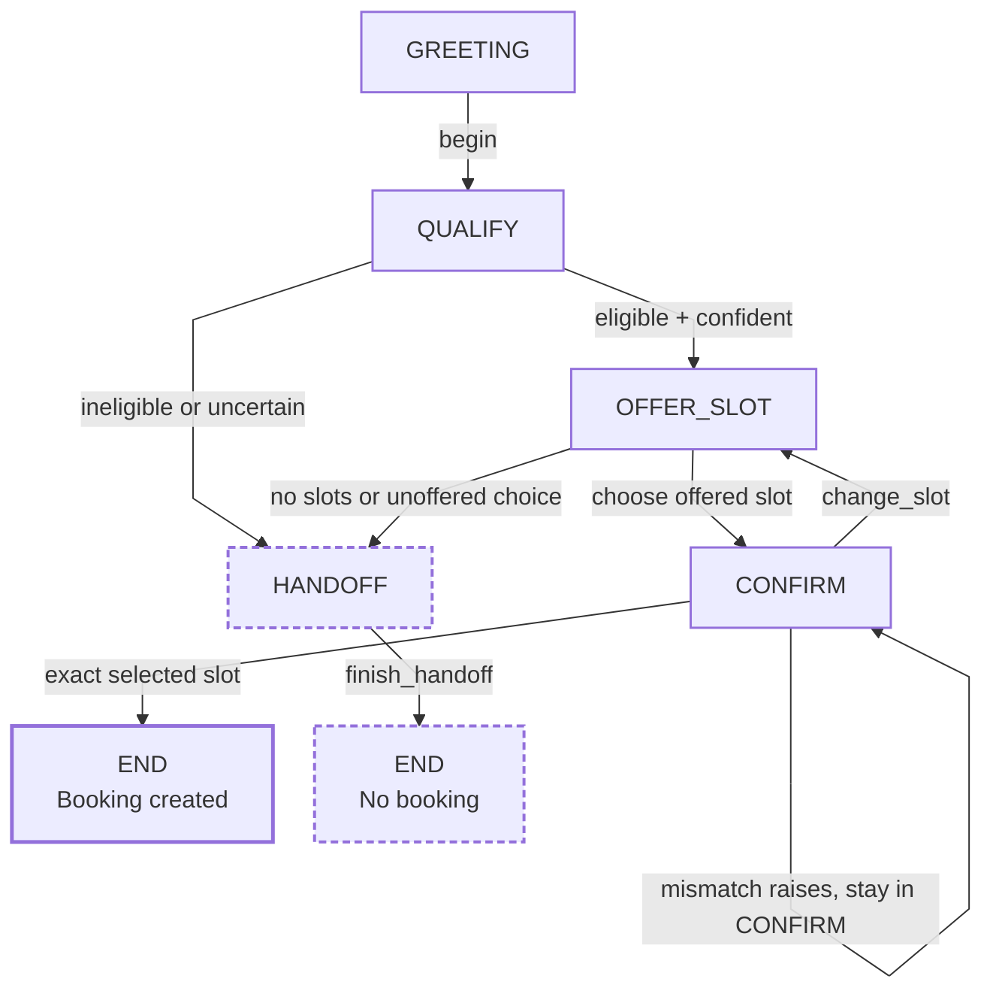

# AI Booking Workflow

A deterministic booking-state core that only creates a booking value after the caller confirms a slot the system actually offered.

**Calendars are easy until someone books a time the calendar never offered.**

This public sample comes from my broader private voice/receptionist work. It makes the booking rules reviewable on their own; I can build and adapt the surrounding reception workflows, calendar integrations, and applications to a project's needs.

## Booking state machine

The important boundary is narrow: only an exact confirmation of a previously offered, currently selected slot creates `Booking(slot=...)`. Everything uncertain exits the booking path instead of inventing certainty.

## What the workflow enforces

- `GREETING → QUALIFY` is the only start path.
- Qualification reaches `OFFER_SLOT` only when the caller is eligible and confidence is sufficient.
- Supplied slots are trimmed and deduplicated; empty availability hands off instead of becoming a guessed appointment.
- `CONFIRM` is reachable only after selecting a stored `offered_slot`; an unknown choice hands off.
- A mismatched confirmation raises an error and creates no booking. `change_slot()` clears the selection and returns to `OFFER_SLOT`.

## Code to inspect

| File | Responsibility |
|---|---|
| [`availability.py`](src/booking_workflow/availability.py) | Normalize supplied slots without inventing any. |
| [`guardrails.py`](src/booking_workflow/guardrails.py) | Qualification handoff and exact-confirmation checks. |
| [`fsm.py`](src/booking_workflow/fsm.py) | Explicit booking states and transitions. |
| [`models.py`](src/booking_workflow/models.py) | State enum and final `Booking` value. |
| [`tests/`](tests/) | Availability, transition, and guardrail behavior. |

## Boundary

This is the booking decision boundary, not a live booking integration. It contains no provider SDK, persistence layer, patient data, clinic credentials, telephony, or external calendar write.

It also does **not** implement stale-slot revalidation. The public implementation ends when the validated state machine creates a `Booking` value; a real provider write would need its own integration and concurrency controls.

For the exact behavioral contract, see the [state table](docs/state-table.md), [invariants](docs/invariants.md), and [failure modes](docs/failure-modes.md). Verification commands and expected checks are in [docs/verification.md](docs/verification.md). Provenance is documented in [`PROVENANCE.md`](PROVENANCE.md).
